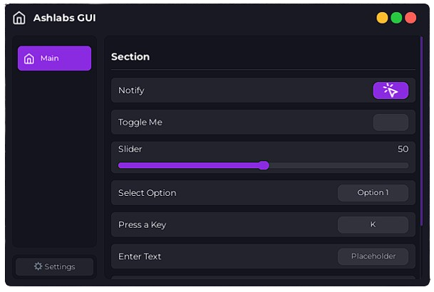

    

<h3 align="center">
    Ash-Libs is a GUI library for Roblox featuring a minimalist, modern, and lightweight design  It helps developers create intuitive and responsive user interfaces without impacting game performance.
</h3>

## Content
- [Example](./example.lua)
- [Docs](./docs/README.md)

## Credit
- [Lucide-Roblox](https://github.com/latte-soft/lucide-roblox)
- [Lucide-Icon](https://lucide.dev)